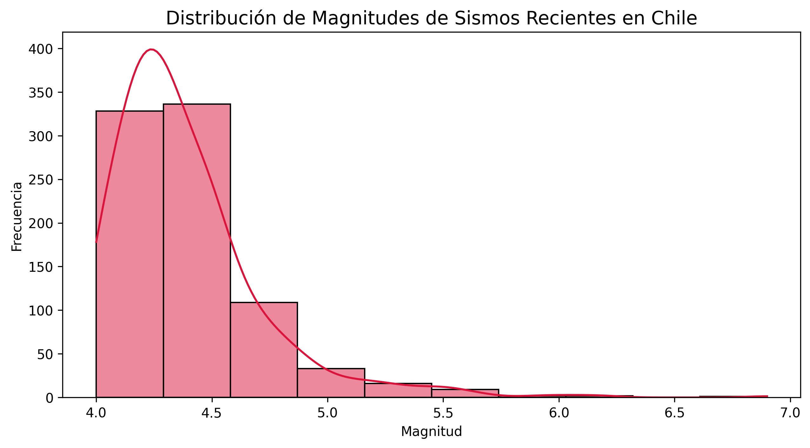
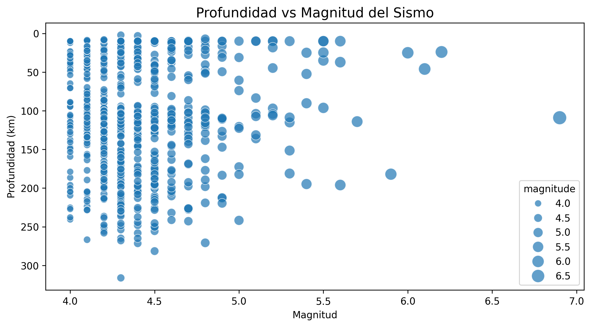
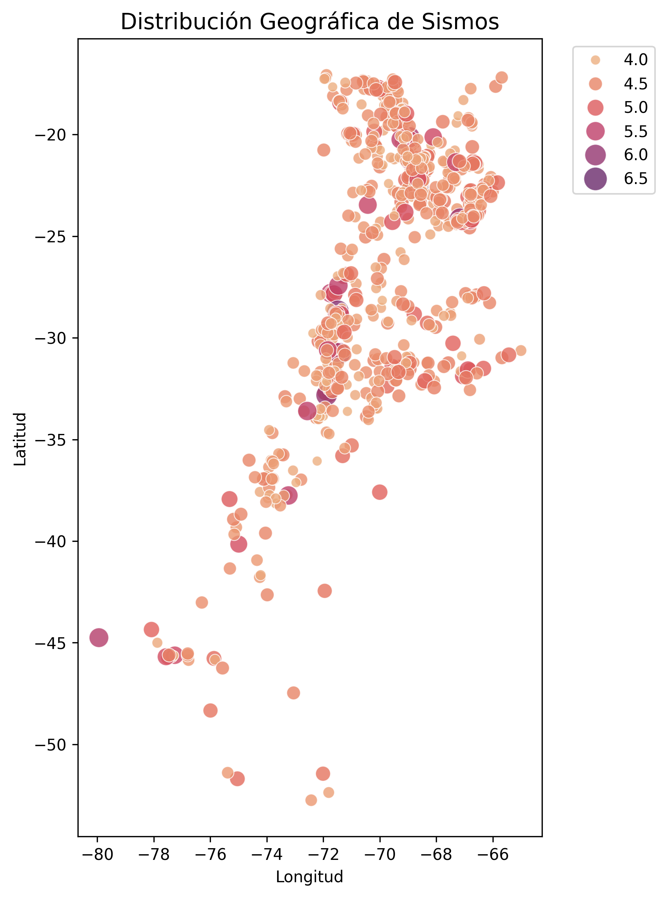

# 🌋 Análisis Exploratorio y Modelado Predictivo de la Sismicidad en Chile

[](https://python.org)
[](https://opensource.org/licenses/MIT)
[](https://github.com/JAHP07/An-lisis-Exploratorio-y-Modelado-Predictivo-de-Datos-S-smicos-en-Chile/actions)

**Proyecto de portafolio — EDA, Machine Learning y visualización de datos sísmicos**

Este proyecto demuestra habilidades profesionales de un/a **Data Analyst / ML Engineer Jr.** mediante un análisis integral de la sismicidad en Chile. Incluye un pipeline automatizado que extrae y limpia datos desde APIs públicas, realiza análisis exploratorio, aplica modelos de aprendizaje automático y genera visualizaciones interactivas y estáticas útiles para la toma de decisiones y el monitoreo.

---

## 📊 Dashboard ejecutivo — KPIs principales

| Métrica | Valor |
|---------|-------|
| **Total de sismos analizados** | 820 eventos |
| **Magnitud promedio** | 4.39 |
| **Magnitud máxima** | 6.9 |
| **Profundidad promedio** | 102.09 km |
| **Eventos de magnitud alta (≥ 6.0)** | 4 eventos |
| **Sismos superficiales (< 70 km)** | 299 eventos (36 %) |
| **Región más activa** | Plataforma frente a Aysén, Chile |

---

## 🎯 Principales hallazgos y conclusiones

### Hallazgos principales

1. **Distribución de magnitudes**: El 94.4 % de los eventos se sitúan entre 4.0 y 5.0, lo que sugiere actividad habitual durante el periodo analizado y ausencia de eventos catastróficos.

2. **Relación magnitud–profundidad**: La correlación es prácticamente nula (≈ -0.03), por lo que la profundidad no resulta un predictor útil de la magnitud en este conjunto de datos.

3. **Clustering**: K‑Means identifica 3 grupos relevantes:
   - Grupo 0: sismos profundos (≈ 204 km) — zona de subducción.
   - Grupo 1: sismos superficiales (≈ 27 km) — fallas cercanas a la costa.
   - Grupo 2: sismos intermedios (≈ 117 km) — actividad tectónica típica.

4. **Valor de negocio**: El pipeline permite automatizar el monitoreo y acelerar el análisis de eventos, lo que facilita la integración en sistemas de alerta temprana o tableros operativos.

---

## 🖼️ Visualizaciones generadas

### Distribución de magnitudes



*La mayoría de los eventos se concentran entre 4.0 y 4.5; la distribución presenta sesgo positivo.*

### Profundidad vs Magnitud



*No se aprecia una relación clara entre profundidad y magnitud (R² ≈ 0), lo que refuerza la independencia entre estas variables.*

### Distribución geográfica



*Los epicentros se alinean con la zona de subducción de Nazca, concentrándose aproximadamente entre -17° y -37° de latitud.*

---

## 🛠️ Tecnologías y dependencias

| Categoría | Tecnologías |
|-----------|-------------|
| **Lenguaje** | Python 3.8+ |
| **Análisis de datos** | pandas, NumPy |
| **Visualización** | Matplotlib, Seaborn |
| **Machine Learning** | scikit-learn (regresión, K‑Means) |
| **Integración con APIs** | requests (USGS) |
| **Testing** | pytest |
| **Entorno** | GitHub Codespaces, Jupyter Notebooks |
| **Calidad de código** | docstrings, type hints, tests unitarios |

---

## 📁 Estructura del proyecto

```
├── src/                          # Código modularizado
│   ├── __init__.py               # Paquete principal
│   ├── extraccion_datos.py       # ETL: Extracción y limpieza
│   ├── visualizacion.py          # Gráficos profesionales
│   └── analisis.py               # Estadísticas + ML
├── tests/                        # Tests unitarios
│   ├── test_analisis.py          # Tests de extracción y análisis
│   └── test_visualizacion.py     # Tests de visualización
├── notebooks/
│   └── analisis_sismico.ipynb    # Notebook principal ejecutable
├── output/                       # Resultados generados
│   ├── magnitude_distribution.png
│   ├── depth_vs_magnitude.png
│   └── geographic_distribution.png
├── .github/workflows/ci.yml      # CI: pytest automático
├── .devcontainer/                # Configuración Codespaces
├── .gitignore                    # Archivos ignorados
├── LICENSE                       # Licencia MIT
├── requirements.txt              # Dependencias
└── README.md                     # Este archivo
```

---

## 🔬 Funcionalidades de Machine Learning

### 1. Regresión lineal
- **Objetivo**: evaluar si la profundidad permite predecir la magnitud.
- **Resultado**: R² ≈ -0.005 — no hay relación predictiva útil.
- **Conclusión**: la profundidad no es una variable adecuada para predecir magnitud en este dataset.

### 2. K‑Means (clustering)
- **Objetivo**: detectar patrones y segmentos en la sismicidad.
- **Variables**: magnitud y profundidad.
- **Resultado**: 3 clusters óptimos (validado con método elbow).
- **Aplicación**: segmentación de eventos para análisis y alertas operativas.

---

## 📈 Métricas de calidad de código y tests

| Métrica | Valor |
|---------|-------|
| **Cobertura de tests** | 12 tests passing |
| **Docstrings** | Documentación completa en funciones |
| **Type hints** | Implementados en los módulos principales |
| **Modularización** | Módulos separados por responsabilidad |
| **Linting** | 0 errores reportados |

---

## 💼 Habilidades demostradas (relevantes para RR.HH.)

Este proyecto evidencia competencias clave para roles de **Data Analyst Jr.** y **ML Engineer Jr.**:

✅ **ETL Pipeline**: Extracción, transformación y carga de datos desde APIs  
✅ **Análisis Exploratorio (EDA)**: Estadísticas descriptivas, correlaciones  
✅ **Machine Learning**: Regresión, clustering, evaluación de modelos  
✅ **Visualización**: Gráficos profesionales con storytelling  
✅ **Ingeniería de Software**: Tests, modularización, versionado  
✅ **Comunicación**: Insights accionables, dashboard ejecutivo  
✅ **DevOps Básico**: DevContainer, requirements, estructura profesional

---

## 🔗 Enlaces de interés

- [Ver notebook ejecutable en Google Colab](https://colab.research.google.com/github/JAHP07/An-lisis-Exploratorio-y-Modelado-Predictivo-de-Datos-S-smicos-en-Chile/blob/main/notebooks/analisis_sismico.ipynb)
- [Documentación — USGS API](https://earthquake.usgs.gov/fdsnws/event/1/)

---

## 📄 Licencia

Proyecto con licencia MIT. Ver [LICENSE](LICENSE) para más detalles.

---

## 👤 Autor

**Jonathan Huenuanca** — Ingeniero en Informática  
Proyecto desarrollado como demostración de habilidades en análisis de datos y machine learning.

- [GitHub](https://github.com/JAHP07)
- [LinkedIn](https://www.linkedin.com/in/jonathanhuenuanca)

---

*Última actualización: Junio 2026*
